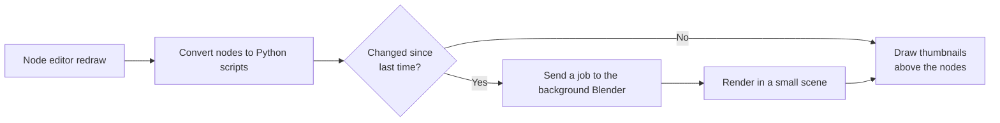

# NodePreview-Optimiz

[日本語](README.md) | English

A Blender add-on that displays rendered preview images (thumbnails) above shader nodes


> [!NOTE]
> Tested on **Blender 5.2**

## Features

- **Per-node previews**: Shows a rendered image of each shader node's output above the node
- **Automatic updates**: When you edit a node, the previews of all affected nodes update automatically
- **Cycles / EEVEE**: Previews are rendered with the current render engine. With EEVEE, EEVEE-only nodes (such as Shader to RGB) are supported too
- **Plane / sphere**: Textures are shown on a plane and BSDFs on a sphere automatically. You can also switch manually
- **Leaves your files untouched**: Nothing is written to the `.blend` file, so people without the add-on can open it as usual
- **High-DPI displays**: Follows Blender's resolution scale setting
- **English / Japanese**: Preferences, menus and text on thumbnails follow Blender's language setting

## Installation

### Option 1: Install the zip from Preferences

1. Download the repository as a zip
2. In Blender, open **Edit > Preferences > Add-ons**
3. From the `⌄` menu at the top right, choose **Install from Disk...** and select the zip from step 1
4. Enable **NodePreview-Optimiz** in the list

### Option 2: Place it in the add-ons folder

1. Download and extract the repository as a zip, or `git clone` it
2. Put the whole folder into Blender's add-ons folder
   - On Windows: `%APPDATA%\Blender Foundation\Blender\5.2\scripts\addons\`
3. Start Blender and enable **NodePreview-Optimiz** in **Edit > Preferences > Add-ons**

> [!WARNING]
> If you enable this together with the original **Node Preview** or **Node Preview Reborn**, previews are drawn twice. Enable only one of them

## Usage

Open the **Shader Editor** (for example in the **Shading** workspace) and previews appear above each node.

### Showing / hiding previews for the whole tree

- Use the button at the right end of the node editor header
- You can also use the **NodePreview-Optimiz** tab in the sidebar (`N` key)

### Shortcuts

| Key | Target | Action |
| --- | --- | --- |
| <kbd>Ctrl</kbd> + <kbd>Shift</kbd> + <kbd>P</kbd> | Selected nodes | Toggle preview visibility |
| <kbd>Ctrl</kbd> + <kbd>P</kbd> | Selected nodes | Switch the preview between plane and sphere |
| <kbd>Shift</kbd> + <kbd>O</kbd> | Active node | Choose which output socket to preview |
| <kbd>Ctrl</kbd> + <kbd>Shift</kbd> + <kbd>I</kbd> | Selected nodes | Ignore the Scale of procedural textures in the preview |

> [!TIP]
> Shortcuts can be changed in **Preferences > Keymap**.

> [!TIP]
> With procedural textures such as Noise or Voronoi, a large Scale makes the pattern unrecognizable in the preview. Press <kbd>Ctrl</kbd> + <kbd>Shift</kbd> + <kbd>I</kbd> to ignore the Scale and see the pattern more easily.

## Settings

Open **Preferences > Add-ons > NodePreview-Optimiz** to change the following settings.

| Setting | Default | Description |
| --- | --- | --- |
| Previews Visible by Default | On | Whether new nodes show a preview from the start |
| Update During Animation Playback | On | Whether previews keep updating during animation playback |
| Thumbnail Scale | 50% | Size of the previews in the node editor |
| Vertical Offset | 5 | Vertical distance between a node and its preview |
| Thumbnail Resolution | 150 | Resolution of the previews. Lower values update faster |
| Background | Checkerboard | Background behind transparent parts (checkerboard / solid color) |
| Show Help Messages | On | Whether to show hints above nodes |
| Enable Debug Output | Off | Whether to print debug information to the system console (requires a Blender restart) |

<details>
<summary>If things feel slow</summary>

- Turn off previews for the whole tree with the header button when you don't need them
- Turn off **Previews Visible by Default** and enable previews only where needed with <kbd>Ctrl</kbd> + <kbd>Shift</kbd> + <kbd>P</kbd>
- Lower **Thumbnail Resolution** to around 64–96
- Switching the render engine to EEVEE makes preview rendering use much less CPU

</details>

## How it works



1. On every node editor redraw, each node is converted into a Python script that recreates just that node
2. Only nodes whose script changed since last time are sent as jobs to a background Blender (`blender -b`)
3. The background Blender rebuilds the nodes in the `src/data/previewscene.blend` scene, renders a single plane or sphere, and returns the result
4. The returned image is drawn above the node with the GPU

Temporary thumbnail files are stored in `BlenderNodePreviewOptimiz_<process ID>` inside the OS temp folder. Folders not updated for more than 24 hours are deleted when Blender exits.

## Limitations

- Images packed into the `.blend` are not previewed until the `.blend` is saved
- Previews of image sequences don't update when the frame changes
- IES nodes are not supported

## Development

The development environment is managed with [uv](https://docs.astral.sh/uv/). [Ruff](https://docs.astral.sh/ruff/) is used for formatting and linting

```sh
# Install development dependencies
uv sync

# Format the code
uv run ruff format

# Lint (use --fix to apply automatic fixes)
uv run ruff check
uv run ruff check --fix
```

The change history is kept in [CHANGELOG.md](CHANGELOG.md)

## License

This project is distributed under the [GNU General Public License v3.0](LICENSE).

Many thanks to the authors of the original projects!!

| Project | Author | Links |
| --- | --- | --- |
| Node Preview (original) | Simon Wendsche | [Gumroad](https://simonwendsche.gumroad.com/l/node-preview) / [Superhive](https://superhivemarket.com/products/node-preview/) |
| Node Preview Reborn | Guillaume Henrion (GYOMH) | [GitHub](https://github.com/gyomh/node-preview-reborn) |

- Copyright (C) 2021 Simon Wendsche
- Copyright (C) 2026 Guillaume Henrion aka GYOMH

For the original projects' history, see the "元プロジェクトの変更履歴" (original project history) section in [CHANGELOG.md](CHANGELOG.md)
