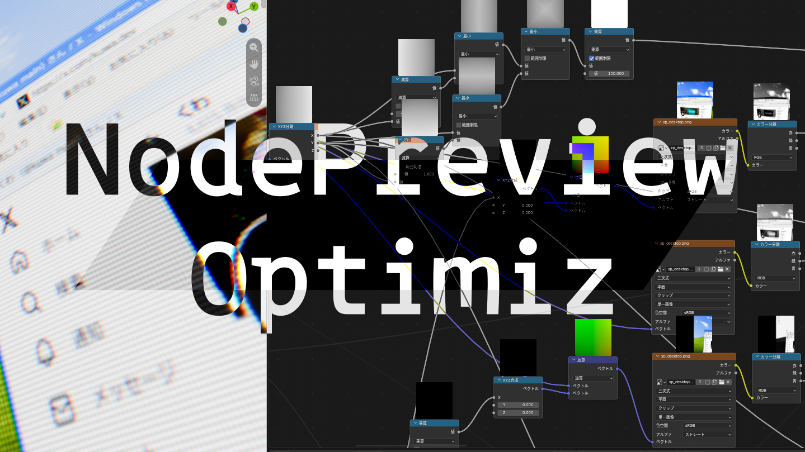
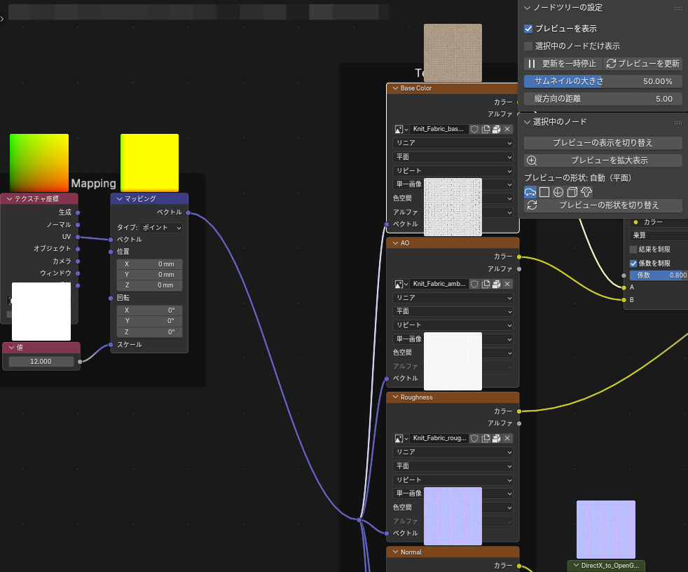
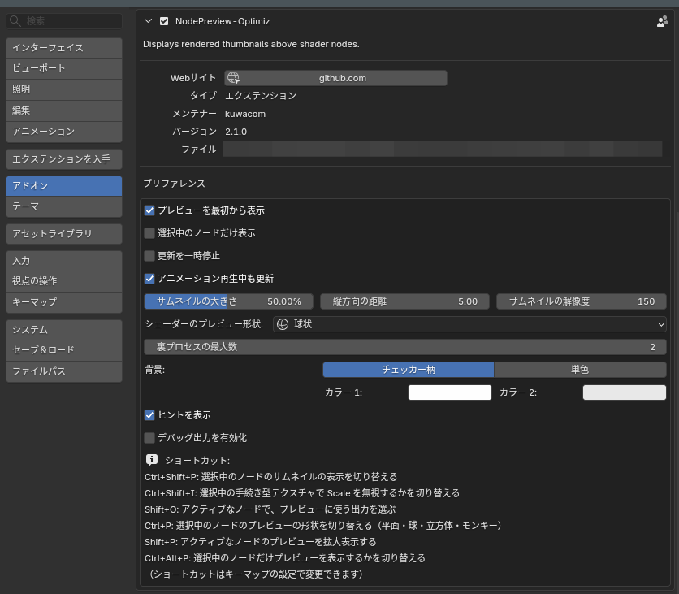
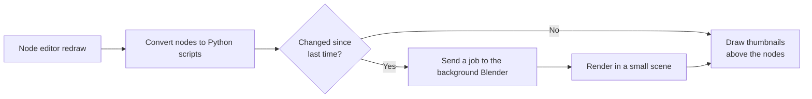

# NodePreview-Optimiz

[日本語](README.md) | English

A Blender add-on that displays rendered preview images (thumbnails) above shader nodes



https://github.com/user-attachments/assets/c85764b9-52e3-40fd-a4a1-9a4914386591

From startup to the first previews, and a preview updating after a value is changed

> [!NOTE]
> Tested on **Blender 5.2**

## Features

- **Per-node previews**: Shows a rendered image of each shader node's output above the node
- **Automatic updates**: When you edit a node, the previews of all affected nodes update automatically
- **Cycles / EEVEE**: Previews are rendered with the current render engine. With EEVEE, EEVEE-only nodes (such as Shader to RGB) are supported too
- **Preview shapes**: Textures are shown on a plane and BSDFs on a sphere (or a cube / monkey, set in the preferences) automatically. You can also switch manually
- **Leaves your files untouched**: Nothing is written to the `.blend` file, so people without the add-on can open it as usual
- **High-DPI displays**: Follows Blender's resolution scale setting
- **English / Japanese**: Preferences, menus and text on thumbnails follow Blender's language setting

## Added and Improved Features

The following features have been added or improved compared to the original project

### Added

- **More preview shapes**: Besides plane and sphere, previews can use a cube or a monkey. The shape used for shader nodes can be chosen in the add-on preferences, and the current shape is highlighted on the buttons
- **Enlarged view**: <kbd>Shift</kbd> + <kbd>P</kbd> re-renders the active node at a higher resolution and shows it large
- **Selected nodes only**: <kbd>Ctrl</kbd> + <kbd>Alt</kbd> + <kbd>P</kbd> previews only the selected nodes. Handy in large node trees
- **Pause and manual refresh**: Stop previews from updating while you edit, and refresh them with a button whenever you like
- **Parallel rendering**: Thumbnails are rendered by several Blender processes in parallel. The maximum number can be changed in the add-on preferences
- **Automatic recovery**: If a rendering process crashes, it is restarted automatically, and the header shows when rendering has stopped
- **English / Japanese**: Preferences, menus and text on thumbnails are translated

### Improved

- **Lighter drawing**: Only the node groups used by the edited tree are converted, and conversion is skipped entirely on redraws without changes
- **More efficient rendering**: Outdated jobs are dropped before being sent, nodes on screen are rendered first, and node groups are reused in the background process
- **Memory cleanup**: Thumbnails of deleted nodes are discarded
- **Startup fix**: Fixed previews not appearing when Blender was started by opening a `.blend` file
- **Extension format**: Uses the `blender_manifest.toml` format of Blender 4.2 and later. The background process no longer relies on enabling the add-on and is loaded directly from its folder
- **Version support**: Supports Blender 4.2–5.2, with deprecated APIs replaced by their newer equivalents. Previews are rendered with EEVEE on 4.2–4.5 too
- **Error logging**: Startup failures and crashes of the background process are printed to the system console in detail

## Installation

### Option 1: Install the zip from Preferences

1. Download `NodePreview-Optimiz.zip` from the [latest release](https://github.com/kuwacom/NodePreview-Optimiz/releases/tag/latest) (built automatically from the latest commit on `main`)
2. In Blender, open **Edit > Preferences > Add-ons**
3. From the `⌄` menu at the top right, choose **Install from Disk...** and select the zip from step 1
4. Enable **NodePreview-Optimiz** in the list

### Option 2: Place it in the extensions folder

1. `git clone` the repository
2. Put the whole folder, named `nodepreview_optimiz`, into Blender's user extensions folder (a symbolic link works too)
   - On Windows: `%APPDATA%\Blender Foundation\Blender\5.2\extensions\user_default\`
3. Start Blender and enable **NodePreview-Optimiz** in **Edit > Preferences > Add-ons**

> [!NOTE]
> Blender versions before 4.2 are not supported. For 4.0 / 4.1, use the version from before the move to the extension format (`7f440e3` or earlier)

> [!WARNING]
> If you enable this together with the original **Node Preview** or **Node Preview Reborn**, previews are drawn twice. Enable only one of them

## Usage

Open the **Shader Editor** (for example in the **Shading** workspace) and previews appear above each node.



### Showing / hiding previews for the whole tree

- Use the button at the right end of the node editor header
- You can also use the **NodePreview-Optimiz** tab in the sidebar (`N` key)

### Shape selection, pause and manual refresh

- Shape buttons are in the sidebar and the header popover. The current shape of the selected nodes is highlighted, and "Mixed" is shown when their settings differ
- The header buttons and the preferences control showing selected nodes only, pausing updates and refreshing manually. Manual refresh also works while paused
- If the background process crashes and can't be restarted, the header shows "Preview stopped". Use the button in the popover to restart it

### Shortcuts

| Key | Target | Action |
| --- | --- | --- |
| <kbd>Ctrl</kbd> + <kbd>Shift</kbd> + <kbd>P</kbd> | Selected nodes | Toggle preview visibility |
| <kbd>Ctrl</kbd> + <kbd>P</kbd> | Selected nodes | Cycle the preview shape: plane, sphere, cube, monkey |
| <kbd>Shift</kbd> + <kbd>P</kbd> | Active node | Show the preview enlarged at a higher resolution (close with <kbd>Esc</kbd> or a click) |
| <kbd>Ctrl</kbd> + <kbd>Alt</kbd> + <kbd>P</kbd> | Whole tree | Toggle showing previews of selected nodes only |
| <kbd>Shift</kbd> + <kbd>O</kbd> | Active node | Choose which output socket to preview |
| <kbd>Ctrl</kbd> + <kbd>Shift</kbd> + <kbd>I</kbd> | Selected nodes | Ignore the Scale of procedural textures in the preview |

> [!TIP]
> Shortcuts can be changed in **Preferences > Keymap**.

> [!TIP]
> With procedural textures such as Noise or Voronoi, a large Scale makes the pattern unrecognizable in the preview. Press <kbd>Ctrl</kbd> + <kbd>Shift</kbd> + <kbd>I</kbd> to ignore the Scale and see the pattern more easily.

## Settings

Open **Preferences > Add-ons > NodePreview-Optimiz** to change the following settings.



| Setting | Default | Description |
| --- | --- | --- |
| Previews Visible by Default | On | Whether new nodes show a preview from the start |
| Selected Nodes Only | Off | Whether to show and render previews of selected nodes only. Handy in large trees |
| Pause Updates | Off | Whether to stop updating previews when nodes are edited. Existing thumbnails stay visible |
| Update During Animation Playback | On | Whether previews keep updating during animation playback |
| Thumbnail Scale | 50% | Size of the previews in the node editor |
| Vertical Offset | 5 | Vertical distance between a node and its preview |
| Surface Preview Shape | Sphere | Shape used for BSDF and similar nodes when the shape is Auto (plane / sphere / cube / monkey). Other nodes always use a plane |
| Max Background Processes | 2 | Maximum number of Blender processes rendering in parallel. Higher is faster but uses more memory (changing it restarts them) |
| Thumbnail Resolution | 150 | Resolution of the previews. Lower values update faster |
| Background | Checkerboard | Background behind transparent parts (checkerboard / solid color) |
| Show Help Messages | On | Whether to show hints above nodes |
| Enable Debug Output | Off | Whether to print debug information to the system console (requires a Blender restart) |

<details>
<summary>If things feel slow</summary>

- Turn off previews for the whole tree with the header button when you don't need them
- Turn off **Previews Visible by Default** and enable previews only where needed with <kbd>Ctrl</kbd> + <kbd>Shift</kbd> + <kbd>P</kbd>
- Lower **Thumbnail Resolution** to around 64–96
- Switching the render engine to EEVEE makes preview rendering use much less CPU

</details>

## How it works



1. On every node editor redraw, each node is converted into a Python script that recreates just that node
2. Only nodes whose script changed since last time are sent as jobs to a background Blender (`blender -b`)
3. The background Blender rebuilds the nodes in the `src/data/previewscene.blend` scene, renders a single plane or 3D shape (sphere, cube or monkey), and returns the result
4. The returned image is drawn above the node with the GPU

Temporary thumbnail files are stored in `BlenderNodePreviewOptimiz_<process ID>` inside the OS temp folder. Folders not updated for more than 24 hours are deleted when Blender exits.

## Limitations

- Images packed into the `.blend` are not previewed until the `.blend` is saved
- Previews of image sequences don't update when the frame changes
- IES nodes are not supported

## Development

The development environment is managed with [uv](https://docs.astral.sh/uv/). [Ruff](https://docs.astral.sh/ruff/) is used for formatting and linting

```sh
# Install development dependencies
uv sync

# Format the code
uv run ruff format

# Lint (use --fix to apply automatic fixes)
uv run ruff check
uv run ruff check --fix

# Validate the extension manifest and build the installable zip
blender --command extension validate
blender --command extension build
```

The change history is kept in [CHANGELOG.md](CHANGELOG.md)

## License

This project is distributed under the [GNU General Public License v3.0](LICENSE).

Many thanks to the authors of the original projects!!

| Project | Author | Links |
| --- | --- | --- |
| Node Preview (original) | Simon Wendsche | [Gumroad](https://simonwendsche.gumroad.com/l/node-preview) / [Superhive](https://superhivemarket.com/products/node-preview/) |
| Node Preview Reborn | Guillaume Henrion (GYOMH) | [GitHub](https://github.com/gyomh/node-preview-reborn) |

- Copyright (C) 2021 Simon Wendsche
- Copyright (C) 2026 Guillaume Henrion aka GYOMH

For the original projects' history, see the "元プロジェクトの変更履歴" (original project history) section in [CHANGELOG.md](CHANGELOG.md)
