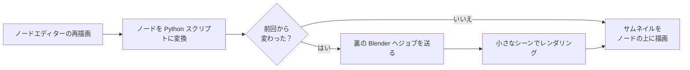

# NodePreview-Optimiz

日本語 | [English](README.en.md)

Blender のシェーダーノードの上に、レンダリングしたプレビュー画像（サムネイル）を表示するアドオンです


> [!NOTE]
> **Blender 5.2** で動作を確認しています

## 主な機能

- **ノードごとのプレビュー**: 各シェーダーノードの上に、そのノードの出力をレンダリングした画像を表示します
- **自動更新**: ノードを編集すると、影響を受けるノードのプレビューが自動で更新されます
- **Cycles / EEVEE 対応**: 今のレンダーエンジンでプレビューを描きます。EEVEE のときは、EEVEE 専用ノード（Shader to RGB など）にも対応します
- **プレビュー形状の切り替え**: テクスチャ系は平面、BSDF 系は球（設定で立方体・モンキーにも変更可）で、自動的に表示を切り替えます。手動で切り替えることもできます
- **元ファイルを汚さない**: `.blend` ファイルには何も書き込みません。アドオンを入れていない人も、そのまま開けます
- **高解像度ディスプレイ対応**: Blender の解像度スケール設定に合わせて表示します
- **日本語 / 英語対応**: Blender の言語設定に合わせて、設定画面やメニュー、サムネイル上の文字が切り替わります

## 追加・改善機能

本家から以下の機能が追加及び改善されています

### 追加

- **プレビュー形状の追加**: 平面・球に加えて、立方体とモンキーでプレビューできます。シェーダー系のノードで使う形状をアドオン設定で選べ、今の形状はボタンの強調で分かります
- **拡大表示**: <kbd>Shift</kbd> + <kbd>P</kbd> で、アクティブなノードを高い解像度でレンダリングし直して大きく表示します
- **選択中のノードだけ表示**: <kbd>Ctrl</kbd> + <kbd>Alt</kbd> + <kbd>P</kbd> で、選択中のノードだけをプレビューします。大きなノードツリーで便利です
- **一時停止と手動更新**: 編集してもプレビューを更新しないようにでき、好きなときにボタンで更新できます
- **裏プロセスの並列化**: サムネイルを複数の Blender で並行してレンダリングします。最大数はアドオン設定で変えられます
- **裏プロセスの自動復帰**: レンダリング用のプロセスが落ちても自動で起動し直し、止まったときはヘッダーに表示されます
- **日本語 / 英語対応**: 設定画面・メニュー・サムネイル上の文字を翻訳しました

### 改善

- **描画の軽量化**: 編集中のツリーで使うノードグループだけを変換し、変更の無い再描画では変換を丸ごと省きます
- **レンダリングの効率化**: 古くなったジョブは送らずに捨て、画面に映っているノードを先に描きます。裏プロセスではノードグループを使い回します
- **メモリの片付け**: 消えたノードのサムネイルを捨てます
- **起動時の不具合修正**: `.blend` を開いて起動したときに、プレビューが表示されない問題を直しました
- **エクステンション形式に対応**: `blender_manifest.toml` を使う Blender 4.2 以降の形式にしました。裏プロセスはアドオンの有効化に頼らず、フォルダの場所から直接読み込みます
- **対応バージョンの整理**: Blender 4.2〜5.2 に対応し、非推奨の API を新しいものに置き換えました。4.2〜4.5 でも EEVEE でプレビューを描きます
- **エラーの記録**: 裏プロセスの起動失敗や異常終了を、システムコンソールに詳しく出します

## インストール

### 方法 1: プリファレンスから zip でインストール

1. [Releases の latest](https://github.com/kuwacom/NodePreview-Optimiz/releases/tag/latest) から `NodePreview-Optimiz.zip` をダウンロードします（`main` の最新コミットから自動で作られます）
2. Blender で **編集 > プリファレンス > アドオン** を開きます
3. 右上の `⌄` メニューから **ディスクからインストール...** を選び、1 の zip を選択します
4. 一覧に出てくる **NodePreview-Optimiz** にチェックを入れて有効にします

### 方法 2: エクステンションフォルダに直接置く

1. リポジトリを `git clone` します
2. フォルダごと、フォルダ名を `nodepreview_optimiz` にして、Blender のユーザー用エクステンションフォルダに置きます（シンボリックリンクでも構いません）
   - Windows の場合: `%APPDATA%\Blender Foundation\Blender\5.2\extensions\user_default\`
3. Blender を起動し、**編集 > プリファレンス > アドオン** で **NodePreview-Optimiz** を有効にします

> [!NOTE]
> Blender 4.2 より前には対応していません。4.0 / 4.1 を使う場合は、エクステンション形式に移行する前の版（`7f440e3` 以前）を使ってください

> [!WARNING]
> 元の **Node Preview** や **Node Preview Reborn** と同時に有効にすると、プレビューが二重に表示されます。どちらか一方だけを有効にしてください

## 使い方

**Shading** ワークスペースなどで **シェーダーエディター** を開くと、各ノードの上にプレビューが表示されます。

### ツリー全体の表示 / 非表示

- ノードエディターのヘッダー右端にあるボタンで切り替えます
- サイドバー（`N` キー）の **NodePreview-Optimiz** タブからも操作できます

### 形状の選択・一時停止・手動更新

- サイドバーとヘッダーのポップオーバーに、形状のボタンが並びます。選択中のノードの今の形状が強調され、設定が混ざっているときは「混在」と出ます
- ヘッダーのボタンと設定から、選択中のノードだけの表示、更新の一時停止、手動更新を操作できます。一時停止中も、手動更新は使えます
- 裏プロセスが落ちて再起動できなくなると、ヘッダーに「プレビュー停止中」と出ます。ポップオーバーのボタンで再起動できます

### ショートカット

| キー | 対象 | 動作 |
| --- | --- | --- |
| <kbd>Ctrl</kbd> + <kbd>Shift</kbd> + <kbd>P</kbd> | 選択中のノード | プレビューの表示 / 非表示を切り替える |
| <kbd>Ctrl</kbd> + <kbd>P</kbd> | 選択中のノード | プレビューの形状を平面・球・立方体・モンキーの順に切り替える |
| <kbd>Shift</kbd> + <kbd>P</kbd> | アクティブなノード | プレビューを高い解像度で拡大表示する（<kbd>Esc</kbd> かクリックで閉じる） |
| <kbd>Ctrl</kbd> + <kbd>Alt</kbd> + <kbd>P</kbd> | ツリー全体 | 選択中のノードだけプレビューを表示するモードを切り替える |
| <kbd>Shift</kbd> + <kbd>O</kbd> | アクティブなノード | プレビューに使う出力ソケットを選ぶ |
| <kbd>Ctrl</kbd> + <kbd>Shift</kbd> + <kbd>I</kbd> | 選択中のノード | 手続き型テクスチャの Scale を無視して表示する |

> [!TIP]
> ショートカットは **プリファレンス > キーマップ** で変更できます。

> [!TIP]
> Noise や Voronoi などの手続き型テクスチャは、Scale が大きいとプレビューで模様が見えなくなります。そういうときは <kbd>Ctrl</kbd> + <kbd>Shift</kbd> + <kbd>I</kbd> で Scale を無視すると、模様を確認しやすくなります。

## 設定

**プリファレンス > アドオン > NodePreview-Optimiz** を開くと、次の項目を設定できます。

| 項目 | 初期値 | 説明 |
| --- | --- | --- |
| Previews Visible by Default | オン | 新しいノードで、最初からプレビューを表示するか |
| Selected Nodes Only | オフ | 選択中のノードのプレビューだけを表示・レンダリングするか。大きなツリーで便利 |
| Pause Updates | オフ | ノードを編集してもプレビューを更新しないか。今のサムネイルは表示されたまま |
| Update During Animation Playback | オン | アニメーション再生中もプレビューを更新するか |
| Thumbnail Scale | 50% | ノードエディター上でのプレビューの大きさ |
| Vertical Offset | 5 | ノードからプレビューまでの縦方向の距離 |
| Surface Preview Shape | 球 | 形状が「自動」のとき、BSDF などのノードに使う形状（平面 / 球 / 立方体 / モンキー）。それ以外のノードは常に平面 |
| Max Background Processes | 2 | 並行してレンダリングする Blender の最大数。増やすと速くなるがメモリを多く使う（変更すると再起動する） |
| Thumbnail Resolution | 150 | プレビューの解像度。下げると更新が速くなる |
| Background | チェッカー | 透明な部分の背景（チェッカー柄 / 単色） |
| Show Help Messages | オン | ノードの上にヒントを表示するか |
| Enable Debug Output | オフ | システムコンソールにデバッグ情報を出すか（変更後は Blender の再起動が必要） |

<details>
<summary>動作が重いと感じたら</summary>

- 使わないときは、ヘッダーのボタンでツリー全体のプレビューを切ってください
- **Previews Visible by Default** をオフにして、必要なノードだけ <kbd>Ctrl</kbd> + <kbd>Shift</kbd> + <kbd>P</kbd> で表示してください
- **Thumbnail Resolution** を 64〜96 程度に下げてください
- レンダーエンジンを EEVEE にすると、プレビューの描画で CPU をあまり使わなくなります

</details>

## 仕組み



1. ノードエディターが再描画されるたびに、各ノードを「そのノードだけを再現する Python スクリプト」に変換します
2. 前回のスクリプトと比べて変わったノードだけを、ジョブとして裏の Blender（`blender -b`）に送ります
3. 裏の Blender は `src/data/previewscene.blend` のシーンでノードを組み立て、平面か立体（球・立方体・モンキー）を 1 枚レンダリングして結果を返します
4. 返ってきた画像を、GPU でノードの上に描画します

サムネイルの一時ファイルは、OS の一時フォルダ内の `BlenderNodePreviewOptimiz_<プロセスID>` に保存されます。24 時間以上更新されていないフォルダは、Blender の終了時に削除されます。

## 制限事項

- `.blend` にパック（埋め込み）した画像は、`.blend` を保存するまでプレビューに出ません
- 画像シーケンスのプレビューは、フレームを変えても更新されません
- IES ノードには対応していません

## 開発

開発環境は [uv](https://docs.astral.sh/uv/) で管理しています。整形と静的チェックには [Ruff](https://docs.astral.sh/ruff/) を使います

```sh
# 開発用の依存関係をインストール
uv sync

# コードを整形
uv run ruff format

# 静的チェック（--fix で自動修正できるものは直す）
uv run ruff check
uv run ruff check --fix

# エクステンションのマニフェストを検証し、インストール用の zip を作る
blender --command extension validate
blender --command extension build
```

変更履歴は [CHANGELOG.md](CHANGELOG.md) に記録しています

## ライセンス

このプロジェクトは [GNU General Public License v3.0](LICENSE) の下で配布しています。

元プロジェクトの作者に感謝します！！

| プロジェクト | 作者 | リンク |
| --- | --- | --- |
| Node Preview（オリジナル） | Simon Wendsche | [Gumroad](https://simonwendsche.gumroad.com/l/node-preview) / [Superhive](https://superhivemarket.com/products/node-preview/) |
| Node Preview Reborn | Guillaume Henrion（GYOMH） | [GitHub](https://github.com/gyomh/node-preview-reborn) |

- Copyright (C) 2021 Simon Wendsche
- Copyright (C) 2026 Guillaume Henrion aka GYOMH

元プロジェクトの更新履歴は [CHANGELOG.md](CHANGELOG.md) の「元プロジェクトの変更履歴」を参照してください
