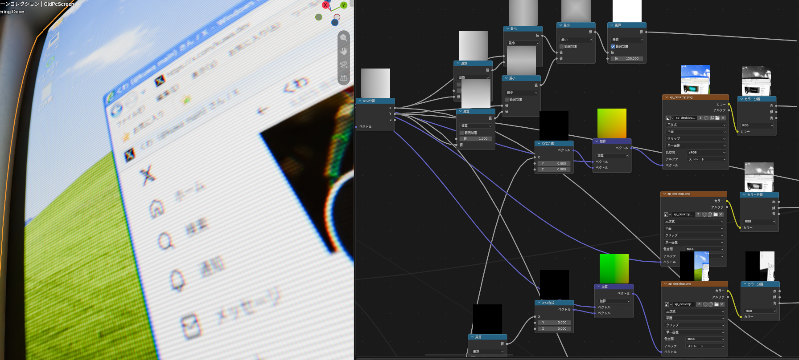
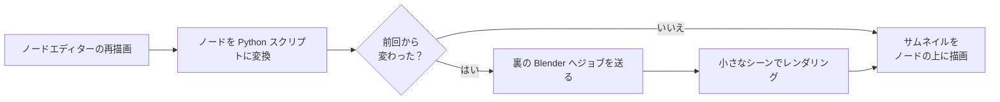

# NodePreview-Optimiz

Blender のシェーダーノードの上に、レンダリングしたプレビュー画像（サムネイル）を表示するアドオンです

> [!NOTE]
> **Blender 5.2** で動作を確認しています

## 主な機能

- **ノードごとのプレビュー**: 各シェーダーノードの上に、そのノードの出力をレンダリングした画像を表示します
- **自動更新**: ノードを編集すると、影響を受けるノードのプレビューが自動で更新されます
- **Cycles / EEVEE 対応**: 今のレンダーエンジンでプレビューを描きます。EEVEE のときは、EEVEE 専用ノード（Shader to RGB など）にも対応します
- **平面 / 球の切り替え**: テクスチャ系は平面、BSDF 系は球で、自動的に表示を切り替えます。手動で切り替えることもできます
- **元ファイルを汚さない**: `.blend` ファイルには何も書き込みません。アドオンを入れていない人も、そのまま開けます
- **高解像度ディスプレイ対応**: Blender の解像度スケール設定に合わせて表示します

## インストール

> [!IMPORTANT]
> **アドオンのフォルダ名にハイフン（`-`）を含めないでください。**
> GitHub の zip をそのまま展開すると、フォルダ名が `NodePreview-Optimiz-main` になります。この名前では裏で動くレンダリング用プロセスが起動できず、プレビューが一切表示されません。
> フォルダ名は `node_preview_optimiz` のように、英数字とアンダースコアだけにしてください。どちらのインストール方法でも同じです。

### 方法 1: プリファレンスから zip でインストール

1. リポジトリを zip でダウンロードして展開し、中のフォルダ名を `node_preview_optimiz` に変えます
2. そのフォルダを、もう一度 zip に圧縮します（zip の中身が `node_preview_optimiz/__init__.py` という構成になるようにします）
3. Blender で **編集 > プリファレンス > アドオン** を開きます
4. 右上の `⌄` メニューから **ディスクからインストール...** を選び、2 で作った zip を選択します
5. 一覧に出てくる **NodePreview-Optimiz** にチェックを入れて有効にします

> [!TIP]
> GitHub からダウンロードした zip を、そのまま **ディスクからインストール...** で選ばないでください。zip の中のフォルダ名がハイフン入りのままなので、プレビューが表示されません。

### 方法 2: アドオンフォルダに直接置く

1. リポジトリを zip でダウンロードして展開するか、`git clone` します
2. フォルダ名を `node_preview_optimiz` に変えて、Blender のアドオンフォルダに置きます
   - Windows の場合: `%APPDATA%\Blender Foundation\Blender\5.2\scripts\addons\`
   - `git clone` する場合は、`git clone <URL> node_preview_optimiz` のように最初からフォルダ名を指定できます
3. Blender を起動し、**編集 > プリファレンス > アドオン** で **NodePreview-Optimiz** を有効にします

> [!WARNING]
> 元の **Node Preview** と同時に入れないでください。内部の識別子が同じなので、登録が衝突します。

## 使い方

**Shading** ワークスペースなどで **シェーダーエディター** を開くと、各ノードの上にプレビューが表示されます。

### ツリー全体の表示 / 非表示

- ノードエディターのヘッダー右端にあるボタンで切り替えます
- サイドバー（`N` キー）の **NodePreview-Optimiz** タブからも操作できます

### ショートカット

| キー | 対象 | 動作 |
| --- | --- | --- |
| <kbd>Ctrl</kbd> + <kbd>Shift</kbd> + <kbd>P</kbd> | 選択中のノード | プレビューの表示 / 非表示を切り替える |
| <kbd>Ctrl</kbd> + <kbd>P</kbd> | 選択中のノード | プレビューを平面と球で切り替える |
| <kbd>Shift</kbd> + <kbd>O</kbd> | アクティブなノード | プレビューに使う出力ソケットを選ぶ |
| <kbd>Ctrl</kbd> + <kbd>Shift</kbd> + <kbd>I</kbd> | 選択中のノード | 手続き型テクスチャの Scale を無視して表示する |

> [!TIP]
> ショートカットは **プリファレンス > キーマップ** で変更できます。

> [!TIP]
> Noise や Voronoi などの手続き型テクスチャは、Scale が大きいとプレビューで模様が見えなくなります。そういうときは <kbd>Ctrl</kbd> + <kbd>Shift</kbd> + <kbd>I</kbd> で Scale を無視すると、模様を確認しやすくなります。

## 設定

**プリファレンス > アドオン > NodePreview-Optimiz** を開くと、次の項目を設定できます。

| 項目 | 初期値 | 説明 |
| --- | --- | --- |
| Previews Visible by Default | オン | 新しいノードで、最初からプレビューを表示するか |
| Update During Animation Playback | オン | アニメーション再生中もプレビューを更新するか |
| Thumbnail Scale | 50% | ノードエディター上でのプレビューの大きさ |
| Vertical Offset | 5 | ノードからプレビューまでの縦方向の距離 |
| Thumbnail Resolution | 150 | プレビューの解像度。下げると更新が速くなる |
| Background | チェッカー | 透明な部分の背景（チェッカー柄 / 単色） |
| Show Help Messages | オン | ノードの上にヒントを表示するか |
| Enable Debug Output | オフ | システムコンソールにデバッグ情報を出すか（変更後は Blender の再起動が必要） |

動作が重いと感じたら

- 使わないときは、ヘッダーのボタンでツリー全体のプレビューを切ってください
- **Previews Visible by Default** をオフにして、必要なノードだけ <kbd>Ctrl</kbd> + <kbd>Shift</kbd> + <kbd>P</kbd> で表示してください
- **Thumbnail Resolution** を 64〜96 程度に下げてください
- レンダーエンジンを EEVEE にすると、プレビューの描画で CPU をあまり使わなくなります

## 仕組み

1. ノードエディターが再描画されるたびに、各ノードを「そのノードだけを再現する Python スクリプト」に変換します
2. 前回のスクリプトと比べて変わったノードだけを、ジョブとして裏の Blender（`blender -b`）に送ります
3. 裏の Blender は `data/previewscene.blend` のシーンでノードを組み立て、平面か球を 1 枚レンダリングして結果を返します
4. 返ってきた画像を、GPU でノードの上に描画します

サムネイルの一時ファイルは、OS の一時フォルダ内の `BlenderNodePreview_<プロセスID>` に保存されます。24 時間以上更新されていないフォルダは、Blender の終了時に削除されます。

## 制限事項

- `.blend` にパック（埋め込み）した画像は、`.blend` を保存するまでプレビューに出ません
- 画像シーケンスのプレビューは、フレームを変えても更新されません
- IES ノードには対応していません

## ライセンス

このプロジェクトは [GNU General Public License v3.0](LICENSE) の下で配布しています。

元プロジェクトの作者に感謝します！！

| プロジェクト | 作者 | リンク |
| --- | --- | --- |
| Node Preview（オリジナル） | Simon Wendsche | [Gumroad](https://simonwendsche.gumroad.com/l/node-preview) / [Superhive](https://superhivemarket.com/products/node-preview/) |
| Node Preview Reborn | Guillaume Henrion（GYOMH） | [GitHub](https://github.com/gyomh/node-preview-reborn) |

- Copyright (C) 2021 Simon Wendsche
- Copyright (C) 2026 Guillaume Henrion aka GYOMH

元プロジェクトの更新履歴は [documentation.txt](documentation.txt) を参照してください。
